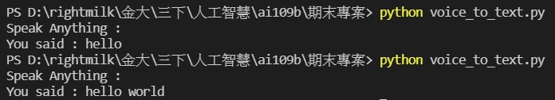

# 課程:人工智慧 -- 期末專案

## 前言
* Neural Networks 在影像、文字、語音等自然使用者介面(NUI)處理有突破性的發展，之前我們已經見證過影像及文字的辨識威力了，從這一篇開始，我們要開始見識『自動語音識別』(Automatic Speech Recognition)方面的發展。

## 語音處理的概念
* 人類講話的聲音可以以『示波器』(Oscilloscope)測量成一個隨時間變化的波形信號，這種信號對時間的關係，稱之為『時域』(Time Domain)，在電腦對信號進行分析時，通常信號會先被轉換成在不同頻率下對應的振幅及相位，稱之為『頻域』（frequency domain），轉換的公式稱為『傅立葉變換』（Fourier transform)，信號經過每隔一段時間取樣，就得到可以進行分析的數位音檔，附檔名通常是 wav。

    
    圖1. 『示波器』(Oscilloscope)，圖片來源：國立臺灣大學普通物理實驗室

    
圖2. 聲音取樣，圖片來源：國立臺灣大學普通物理實驗室

* 為了方便作語音辨識，與影像一樣，我們會對語音作特徵抽取(Feature Extraction)，目前有 FBank、MFCC(Mel frequency cepstral coefficients) 兩種，特徵抽取前須先對聲音作前置處理：

* 幀(Frame)切割：通常每幀是25ms，幀與幀之間重疊10ms，以避免邊界信號的遺漏。
信號加強：針對高頻信號作加強，使信號更清楚。
加窗(Window)：目的是消除各個幀兩端可能會造成的信號不連續性，常用的窗函數有方窗、漢明窗等。
去除雜訊(denoising or noise reduction)。

圖3. 聲音前置處理，圖片來源：Preprocessing

圖4. Windowing and frame formation，圖片來源：Preprocessing

## 程式碼
```
#voice_to_text.py

# install the required package using: 
# pip install SpeechRecognitio pyaudio

import speech_recognition as sr     # import the library
 
r = sr.Recognizer()                 # initialize recognizer
with sr.Microphone() as source:     # mention source it will be either Microphone or audio files.
    print("Speak Anything :")
    audio = r.listen(source)        # listen to the source
    try:
        text = r.recognize_google(audio,language='en-US' )    # use recognizer to convert our audio into text part.
        print("You said : {}".format(text))
    except:
        print("Sorry could not recognize your voice")    # In case of voice not recognized  clearly
```

## 步驟
1. pip install SpeechRecognition
1. pip install pipwin
1. pipwin install pyaudio
1. python voice_to_text.py

## 執行結果
