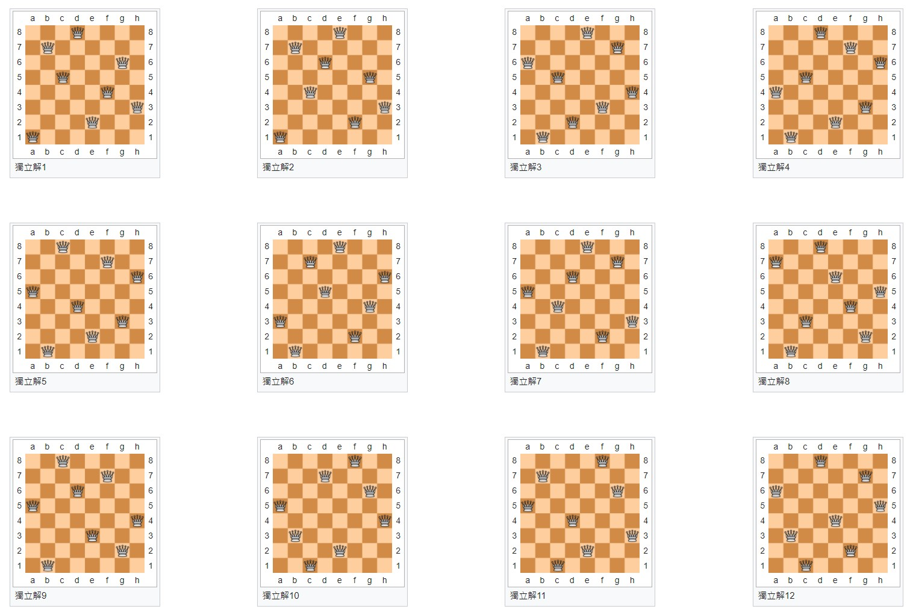

# 第五週筆記

### 八皇后問題

* 八皇后問題是一個以西洋棋為背景的問題：如何能夠在8×8的西洋棋棋盤上放置八個皇后，使得任何一個皇后都無法直接吃掉其他的皇后？為了達到此目的，任兩個皇后都不能處於同一條橫行、縱行或斜線上。八皇后問題可以推廣為更一般的n皇后擺放問題：這時棋盤的大小變為n×n，而皇后個數也變成n。若且唯若n = 1或n ≥ 4時問題有解。

* 八個皇后在8x8棋盤上共有4,426,165,368（64C8）種擺放方法，但只有92個互不相同的解。如果將旋轉和對稱的解歸為一種的話，則一共有12個獨立解，具體如下：



```
per_result = []
def per(lst,s,e):
    if s == e:
        per_result.append(list(lst))
    else:
        for i in range(s,e):
            lst[i],lst[s] = lst[s],lst[i]
            per(lst,s+1,e)#遞迴
            lst[i],lst[s] = lst[s],lst[i]

def shear(lst):
    result = 0
    for i in range(len(lst)):
        for j in range(i+1,len(lst)):
            if(abs(lst[j] - lst[i]) == abs(j-i)):
                result += 1
    if(result > 0):
        return True
    else:
        return False

def stamp(st):
    for i in st:
        for j in range(len(i)):
            a = ("."*(i[j]-1)+"#"+"."*(len(i)-i[j]))
            print(a,"\t")
        print(" ")
num = 8
lst = [i+1 for i in range(num)]
per(lst,0,num)
queen_lst = []
for i in per_result:
    if(shear(i) == False):
        queen_lst.append(i)
stamp(queen_lst)
print("共{:d}種可能".format(len(queen_lst)))
```


## 真值表
### 說明
* 真值表是使用於邏輯中（特別是在連結邏輯代數、布林函數和命題邏輯上）的一類數學用表，用來計算邏輯表示式在每種論證（即每種邏輯變數取值的組合）上的值。尤其是，真值表可以用來判斷一個命題表示式是否對所有允許的輸入值皆為真，亦即是否為邏輯有效的。

```
def truthTable(n): # 列出 n 變數的所有可能 0,1 排列
	p = [] # p 代表已經排下去的，一開始還沒排，所以是空的
	return tableNext(n, p) # 呼叫 tableNext 遞迴下去排出所有可能

def tableNext(n, p):
	i = len(p)      # i 是下一個排列的位置
	if i == n:		# 全部排好了
		print(p)	# 印出排列
		return      # 返回上層
	for x in [0,1]:     # x 是 0 或 1
		p.append(x)		# 把 x 放進表
		tableNext(n, p)	# 繼續遞迴尋找下一個排列
		p.pop()			# 把 x 移出表

truthTable(2) # 印出 2 變數的真值表
truthTable(3) # 印出 3 變數的真值表
```