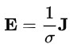

# 第六週筆記
## 電磁場的動力學理論
* 是一篇詹姆斯·馬克士威發於1864年的論文，這篇論文是他所寫的第三篇關於電磁學的論文。在這篇論文裏，他首次系統性地陳列出馬克士威方程組。馬克士威又應用了先前在他的1861年論文《論物理力線》裏提出的位移電流的概念，來推導出電磁波方程式。由於這導引將電學、磁學和光學聯結成一個統一理論。這創舉現在已被物理學術界公認為物理學史的重大里程碑。
    * 推論出波動的速度非常接近光速。
    * 光和電磁波都是同樣物質的屬性。
    * 光波是按照電磁定律傳播於電磁場的電磁擾動。

* 以向量標記，馬克士威方程組的原先版本的八個方程式，分別寫為
1. 總電流定律 

1. 磁場方程式 

1. 安培環路定理 

1. 勞侖茲力方程式 

1. 電彈性方程式 

1. 歐姆定律 

1. 高斯定律 

1. 連續方程式 

