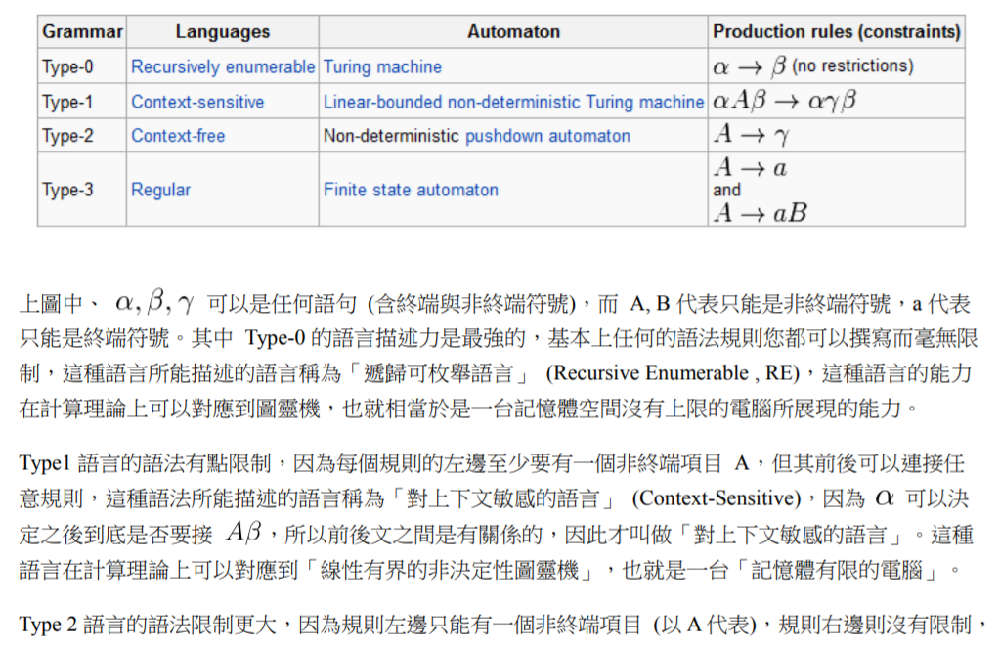
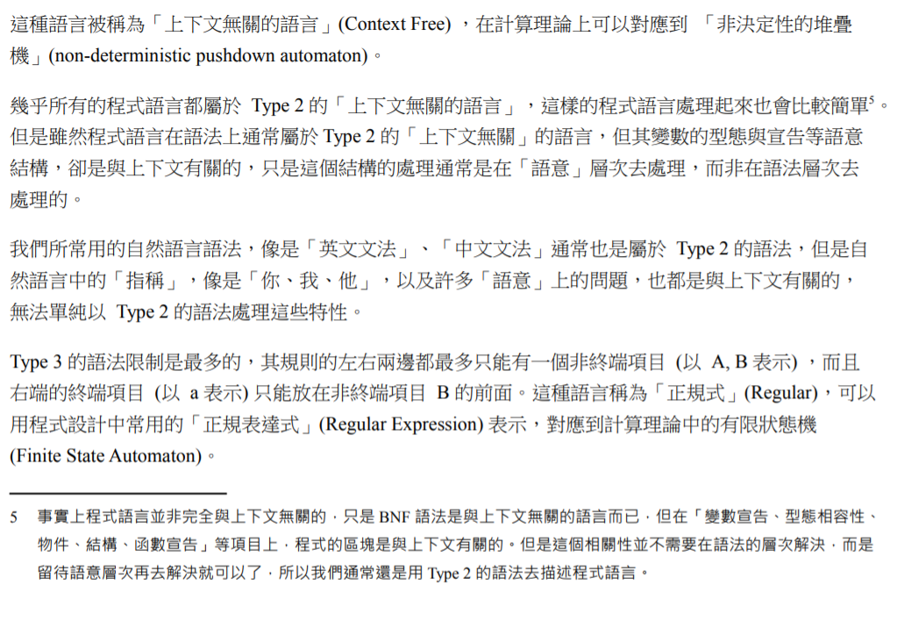
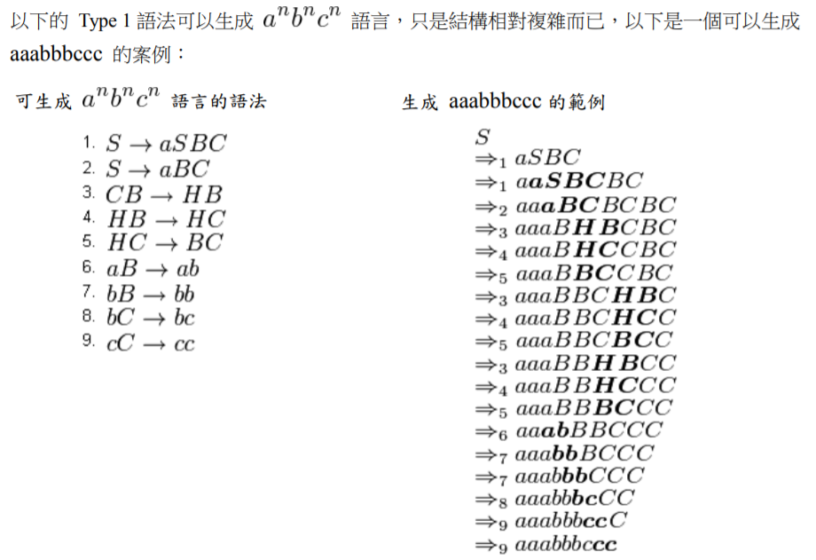

# 第十二週筆記

## 巴科斯範式
* 巴科斯範式（英語：Backus Normal Form，縮寫為 BNF），又稱為巴科斯-諾爾範式（英語：Backus-Naur Form，縮寫同樣為 BNF，也譯為巴科斯-瑙爾範式、巴克斯-諾爾範式），是一種用於表示上下文無關文法的語言，上下文無關文法描述了一類形式語言。它是由約翰·巴科斯（John Backus）和彼得·諾爾（Peter Naur）首先引入的用來描述計算機語言語法的符號集。

* 儘管巴科斯範式也能表示一部分自然語言的語法，它還是更廣泛地使用於程式設計語言、指令集、通信協議的語法表示中。大多數程式設計語言或者形式語義方面的教科書都採用巴科斯範式。在各種文獻中還存在巴科斯範式的一些變體，如擴展巴科斯範式 EBNF 或擴充巴科斯範式 ABNF。

## 喬姆斯基語言階層

